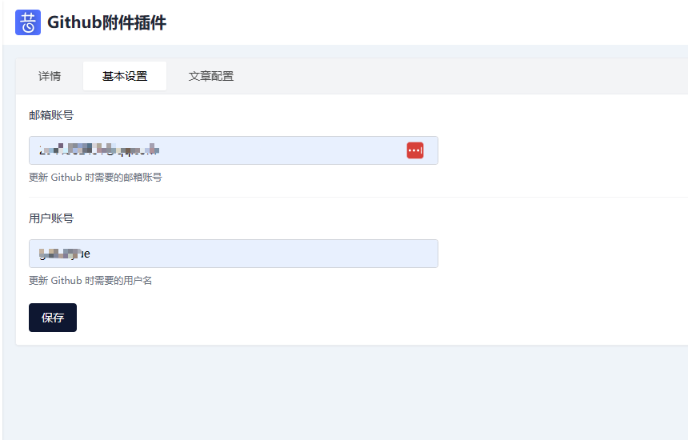
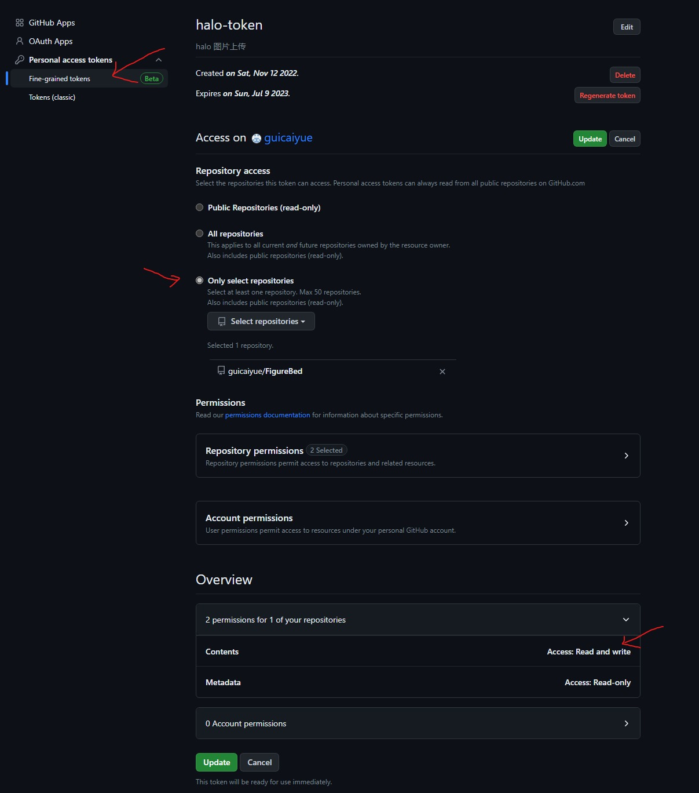
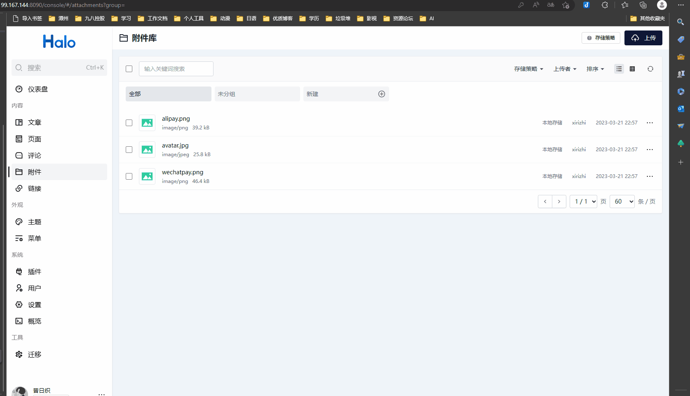

<H2 align="center">GitHubOSS <a href="https://github.com/halo-dev/halo#">Halo</a>插件</H2>

<p align="center">
<a href="https://github.com/guicaiyue/plugin-githuboss/releases"></a>
<a href="https://github.com/guicaiyue/plugin-githuboss/commits"></a>
<br />
<a href="https://github.com/guicaiyue/plugin-githuboss/issues">Issues</a>
<a href="mailto:2941328431@qq.com">邮箱</a>
</p>

------------------------------

## **为 Halo 2.0 提供GitHub OSS 的存储策略**

### 功能特点
1. 支持使用 Github 做附件存储
2. 支持删除文件时可以不同步删除仓库
3. 支持创建一个存储策略时初始化此目录下已有的图片信息
4. 支持用户查看文章时加速图片打开(jsdelivr 多域名测速，取最优域名加载图片)

## 获取插件方式
### 在 Release 下载最新
### 使用 workflows 打包
### 本地打包
下载源码后，执行以下命令
```
./gradlew build
```
构建完成之后，可以在 build/libs 目录得到插件的 JAR 包，在 Halo 后台的插件管理上传即可。

## 如何使用
插件安装完成启用后
1. 点击插件配置插件的基础信息，补充邮件地址，用户名
   ;
2. 创建公开的 github 仓库,创建凭据
   ;
3. 创建存储策略
   ;


